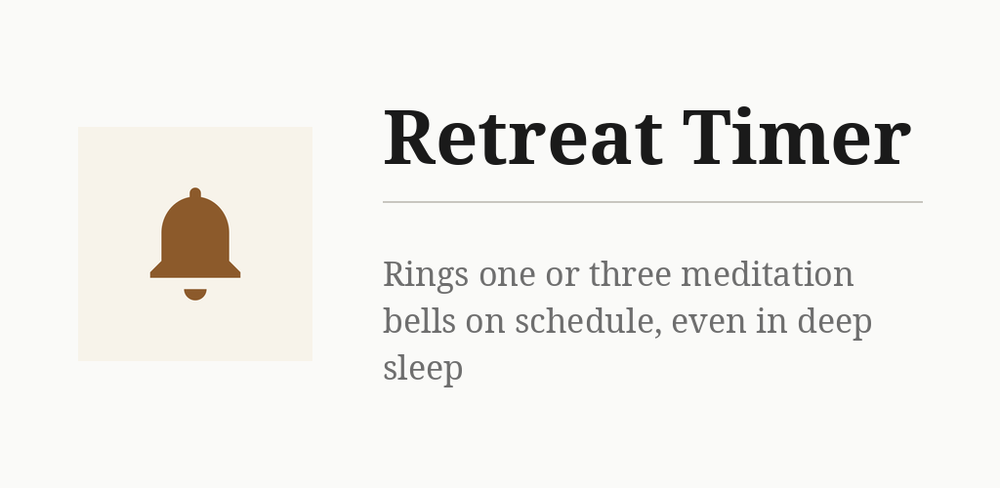
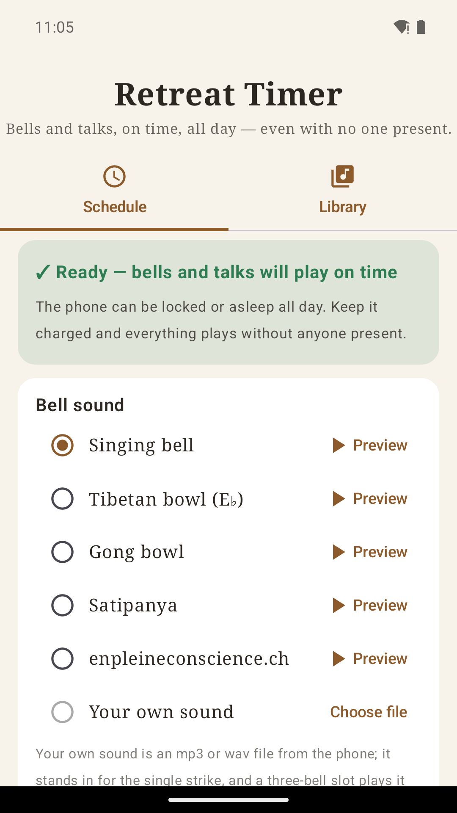
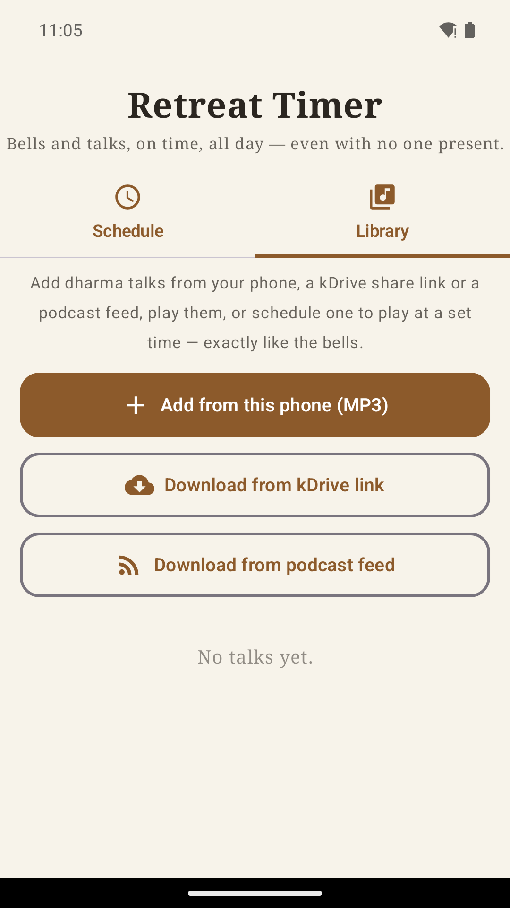

# Retreat Timer

Set the times of day; one bell or three ring at each, every day, so a retreat runs
with no one at the bell. The bells ring through lock, Doze and reboot,
and a green light says when the phone is ready to be left alone. Five bowls at
matched loudness or your own sound, and talks scheduled like bells. No ads, no account.

## Key points

- **Add bell** opens a time picker ready for typing (any minute); choose three bells
  or one there, and preview it. Tap a time to edit it; the switch turns a bell off.
- The schedule repeats every day. A ×3 or ×1 badge shows each bell's strike count.
- The green "Ready" light comes on once battery optimisation is disabled and
  notifications are allowed. Keep the phone plugged in.
- Bell volume and talk volume are separate, each with a Test button; bells play on
  the alarm stream, whatever the media volume.
- Bell sound: five bowls, or your own mp3/wav ("Choose file"), copied into the app.
- **Library** tab: add talks from the phone (MP3), a public kDrive link or a podcast
  feed, then play them or schedule them like bells. This is the only use of the network.
- Player bar and notification: draggable progress, restart, −10 s, play/pause, +10 s, stop.
- **Keep Bluetooth speaker awake** (off by default) streams silence between bells so
  a portable speaker does not drop the link.
- No tracking. Settings, schedule and talks stay on the phone.

More detail: [docs/NOTES.md](docs/NOTES.md).

## Install


[](https://gallaz.ch/eink/#retreat-timer)

- **F-Droid** (recommended, updates arrive by themselves): add the repository from [gallaz.ch/eink](https://gallaz.ch/eink/#fdroid), or the address `https://funkypitt.github.io/fdroid-repo/repo` in F-Droid.
- **Obtainium**: tap the badge on the phone, or add `https://github.com/funkypitt/retreat-timer` in Obtainium.
- **APK**: attached to the [latest release](../../releases/latest). No automatic updates.

All three deliver the same file, with the same signature.

## Build

```
./gradlew assembleDebug
```

The bundled bell files are made with ffmpeg from the samples in the repo root; the
commands are in [docs/NOTES.md](docs/NOTES.md).

## Crédits / Credits

© 2026 Pierre Gallaz. Développé avec [Claude Code](https://claude.com/claude-code) (Anthropic).
Licence MIT, voir `LICENSE`.

© 2026 Pierre Gallaz. Developed with [Claude Code](https://claude.com/claude-code) (Anthropic).
MIT licence, see `LICENSE`.

## Captures d'écran

 
